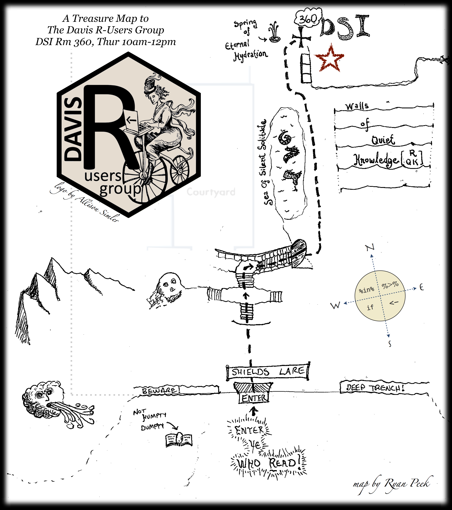

<article class="row">
  <section class="small-12 large-8 columns page-content" markdown="1">

***"The sweetest R-help group this side of the Mississippi."***

Welcome to the Davis R Users' Group (D-RUG)!  We are a community of R-Users at UC Davis who support each other in using R for science and research. Our focus is providing a space for beginning and intermediate users to learn from each other. We have weekly, 2-hour work sessions where people bring their computers to work on their own projects, and ask each other questions as needed.  We have no TAs - just mutual support from folks working on/in R and related topics.  Group members sometimes give short presentations on R methods and best practices or to get feedback on their projects.

## Join the Mailing List

Join the group listserv [here](https://groups.google.com/d/forum/davis-rug). The mailing list is an online supplement to our in-person work sessions, and a friendly place to post R-related questions.

## Weekly Work Sessions

 - **Spring Quarter 2018**: **MONDAYS from 10am-12pm in 360 Shields** (the Data Science Space on the third floor of Shields Library). 

*A map to the DSI in Shields Library*

***For real-time updates on weekly work sessions and presentations, follow  [@riverpeek](http://www.twitter.com/riverpeek/), or [@ReiterTaylor](http://www.twitter.com/ReiterTaylor/) on Twitter***

## Use the resources on this site

We've compiled a list of resources to help you get started using R and find answers to your questions.  Click on the "[Getting Started](https://d-rug.github.io/getting-started.html)" or "[Past Presentations](https://d-rug.github.io/pastpresentations/)" tabs above to check them out.

</section>
    
</article>
